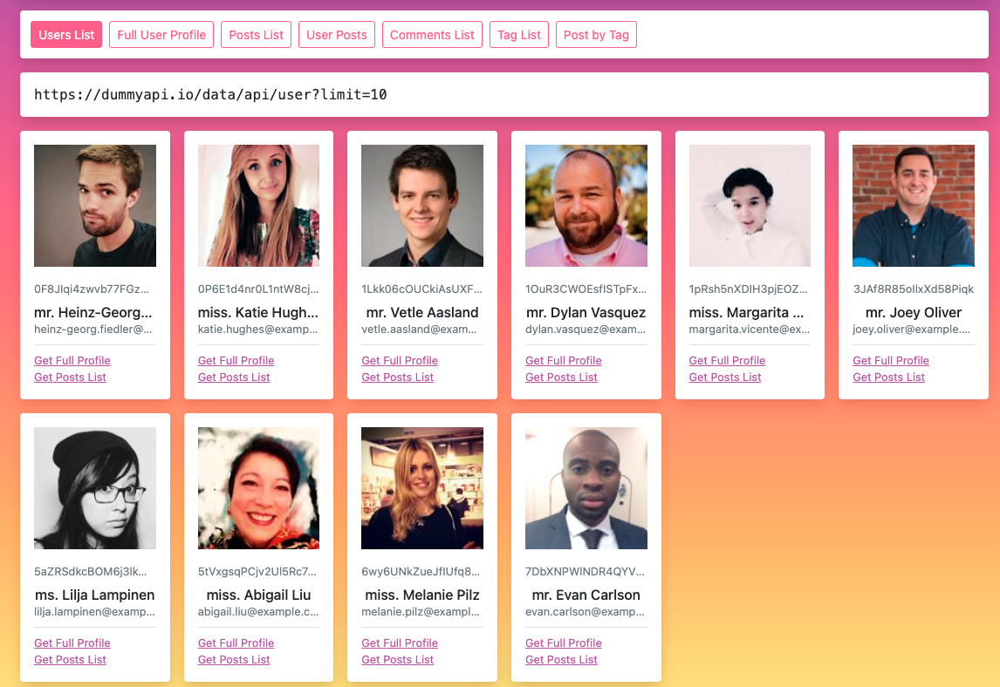

# Environment

Install nodejs:
* https://nodejs.org/en/download/
* https://medium.com/javascript-in-plain-english/how-to-use-npm-and-import-export-modules-in-javascript-31a7f66a2064


Official docs:
* https://reactjs.org/docs/getting-started.html

Folder Structure:
* https://www.javaguides.net/2020/08/reactjs-tutorial-for-beginners-3-folder-structure.html

JSX:
* https://reactjs.org/docs/introducing-jsx.html
* https://reactjs.org/docs/jsx-in-depth.html


# Components

* https://reactjs.org/docs/fragments.html

**Images**
* https://reactgo.com/react-images/

High Order Functions
* https://css-tricks.com/what-are-higher-order-components-in-react/

# Forms

Easy:
* https://dev.to/brettblox/react-hooks-usereducer-4g3m

Modules:
* https://react-hook-form.com/api/#FormContext

* https://reactjs.org/docs/forms.html#handling-multiple-inputs

# State

Oficial doc:
* https://reactjs.org/docs/state-and-lifecycle.html

Read:
* https://www.freecodecamp.org/news/get-pro-with-react-setstate-in-10-minutes-d38251d1c781/

Exercise:
* https://github.com/evyros/react-state-exercises

## Event Handler

* https://reactjs.org/docs/handling-events.html

Exercise:
* https://reactjs.org/docs/handling-events.html


----

## React Hooks

Explain the basics concepts of the Hooks functions for the React Router
* https://react-hooks-cheatsheet.com/

Explain with examples:
* https://blog.logrocket.com/react-hooks-cheat-sheet-unlock-solutions-to-common-problems-af4caf699e70/


React API
* https://blog.logrocket.com/react-reference-guide-hooks-api/

## React Router

 Intro: https://coursework.vschool.io/react-router/

### Router/ Switch / Route / Link / NavLink

* https://www.code-boost.com/react-router-intro/

First assignment: https://thinkster.io/tutorials/fundamentals-of-react-routing-with-react-router/exercise-broken-routing

### React Rouer: Hooks 
* https://blog.logrocket.com/using-hooks-with-react-router/

### Route params: 

**Optional Params** https://www.digitalocean.com/community/tutorials/react-react-router-optional-parameters
**Params v4 vs v5** https://reactgo.com/react-get-url-params/


### Route History
* https://www.ojblabs.com/react-router-history/


### Nested Routes
* https://ui.dev/react-router-v5-nested-routes/
* https://reactgo.com/reactrouter/nestedrouting/


### Assignment React Router + API

Using the API:
* https://restcountries.eu/

To fetch all the countries: https://restcountries.eu/rest/v2/all
To fetch by region: https://restcountries.eu/rest/v2/region/europe

Make an app where you have:
**/regions**    (/regions)
Will list all the regions with links for countries/region

Make an app where you have:
**/countries**    (/countries)
Will list all the countries

**/countries/:region**
Will list all the countries for the given region (/countries/northamerica)

**/countries/:region/:countryname**
This will show the details for one Country, like currencies, flag, name ... (/countries/southamerica/brazil)

* On the left a menu to list all the regions (Africa, Americas, Asia, Europe, Oceania). Each region will have a link  
* On the right you show the list of countries
* IN the countires list, you have to have a button that as you click, you show the more details.


## Deployment

Build Workflow: 
* https://dev.to/amirmoh10/understanding-the-react-build-workflow-and-the-folder-structure-3hlc

Environment Variables:
* https://create-react-app.dev/docs/adding-custom-environment-variables/

Deploy with Vercel:
* https://vercel.com/guides/deploying-react-with-vercel-cra

Deploy with Heroku:
* https://blog.heroku.com/deploying-react-with-zero-configuration


Assignment:
Deploy the Countries/Regions app to Vercel or Heroku

## Interview

To prepare for a React Interview we will use the https://jsonplaceholder.typicode.com/
1. Make a React App that will list the users based on the API
2. Each user will have a Button that will make another request to get posts related to that user




## Hooks

* https://reactjs.org/docs/hooks-intro.html

Exercise:
* https://www.freecodecamp.org/news/hooked-on-hooks-how-to-use-reacts-usereducer-2fe8f486b963/

Global Hooks

* https://medium.com/@chathuranga94/managing-global-state-with-reacts-hooks-context-api-9b9f781d8a3f

Global Hooks with Provider separated:

* https://rahmanfadhil.com/global-state-hooks/

Reducers:

* https://react.christmas/2019/7

## Validations

* https://reactjs.org/docs/error-boundaries.html

# API

* https://reactjs.org/docs/faq-ajax.html
* https://developer.mozilla.org/en-US/docs/Web/API/AbortController

# Test

## Snapshot test

Testing if the components loads without an error
* https://reactrouter.com/web/guides/testing

Dummy tests with Snapshot:
* https://www.valentinog.com/blog/testing-react/

Simple snapshot
```jsx
import React from "react";
import { create } from "react-test-renderer";

function Button(props) {
  return <button>Nothing to do for now</button>;
}

describe("Button component", () => {
  test("Matches the snapshot", () => {
    const button = create(<Button />);
    expect(button.toJSON()).toMatchSnapshot();
  });
});
```


## Test With Router

Testing checking components manually:
* https://testing-library.com/docs/example-react-router/

Test with router:
```jsx
import { MemoryRouter } from 'react-router-dom'

test('full app rendering/navigating', () => {
  render(<MemoryRouter>
            <App />
        </MemoryRouter>)
  // verify page content for expected route
  expect(screen.getByText(/you are home/i)).toBeInTheDocument()
})
```

# Tutorials

* https://github.com/Sanjeev-Thiyagarajan/PERN-STACK-YELP-CLONE
* https://www.youtube.com/watch?v=J01rYl9T3BU&t=238s&ab_channel=freeCodeCamp.org
* https://reactjs.org/docs/portals.html

# Interviews

* https://github.com/sudheerj/reactjs-interview-questions